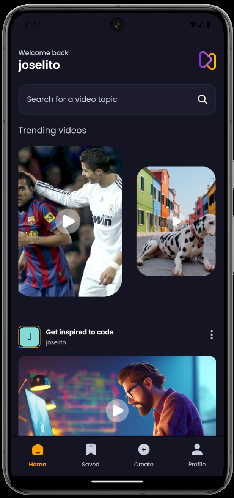
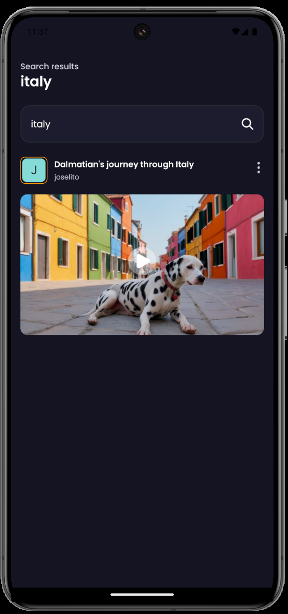
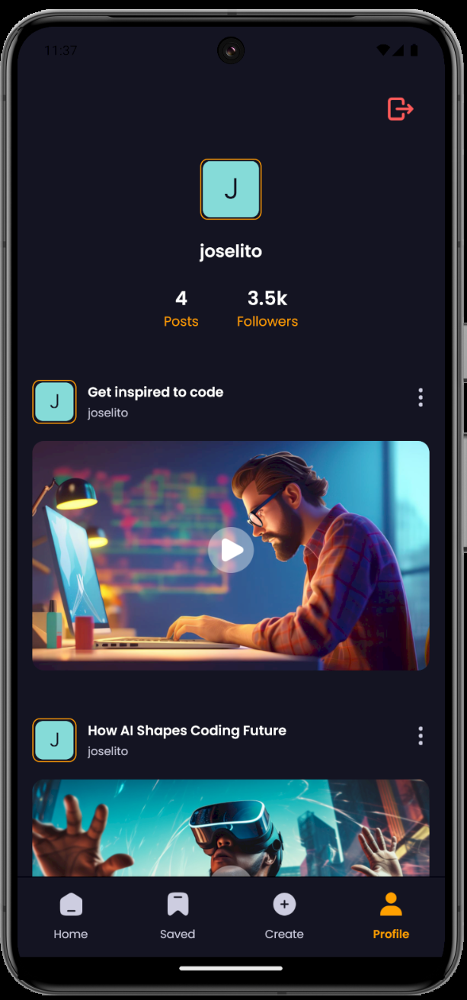
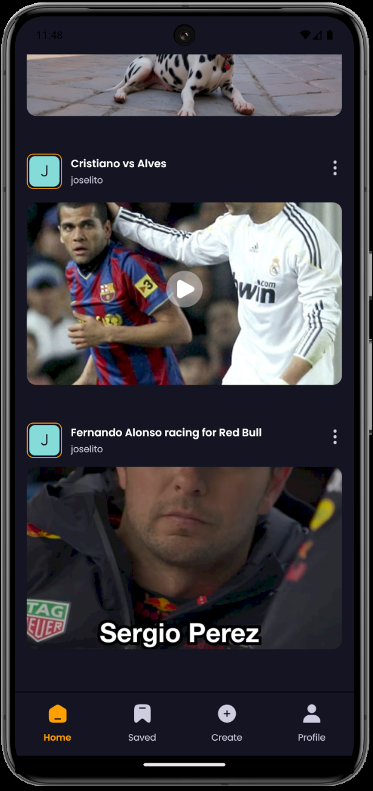

# Video Sharing App

Este proyecto es una aplicación de compartición de videos construida siguiendo el tutorial de [JavaScript Mastery en YouTube](https://www.youtube.com/c/JavaScriptMastery). La idea y estructura original de la app pertenecen a su equipo. Esta aplicación utiliza **React Native**, **Appwrite** como backend y **Nativewind** para los estilos. A continuación, se muestra una breve descripción de la funcionalidad de la aplicación y las tecnologías utilizadas.

## 📋 Descripción

La aplicación permite a los usuarios explorar videos recientes, buscar contenido por palabra clave, crear y subir sus propios videos, y gestionar su perfil personal. La aplicación está optimizada para un rendimiento fluido en dispositivos móviles, con una interfaz intuitiva y animaciones dinámicas.

## ⚙️ Tech Stack

-   **React Native**
-   **Expo**
-   **Nativewind**
-   **Appwrite**
-   **Animatable**

## 🔋 Características

-   **Pantalla de Inicio**: Explora los videos más recientes y los trending, con una barra de búsqueda para encontrar contenido rápidamente.
-   **Búsqueda**: Permite buscar videos por palabras clave con resultados instantáneos.
-   **Perfil de Usuario**: Muestra los videos subidos por el usuario y estadísticas relacionadas.
-   **Subida de Video**: Los usuarios pueden subir videos con título, descripción, miniatura y prompt de IA.
-   **Formulario de Creación**: Incluye un formulario completo para la creación de videos con campos editables.
-   **Animaciones**: Interacciones suaves gracias a la biblioteca Animatable.

## 🤸 Capturas de Pantalla

### 1. Home: Videos Recientes y Barra de Búsqueda

### 2. Búsqueda: Resultado al Buscar "Italy"

### 3. Perfil del Usuario: Videos Subidos

### 4. Subir Video: Formulario de Creación

### 5. Formulario de Creación con Datos Llenos

### 6. Home: Mostrando el Video Subido

