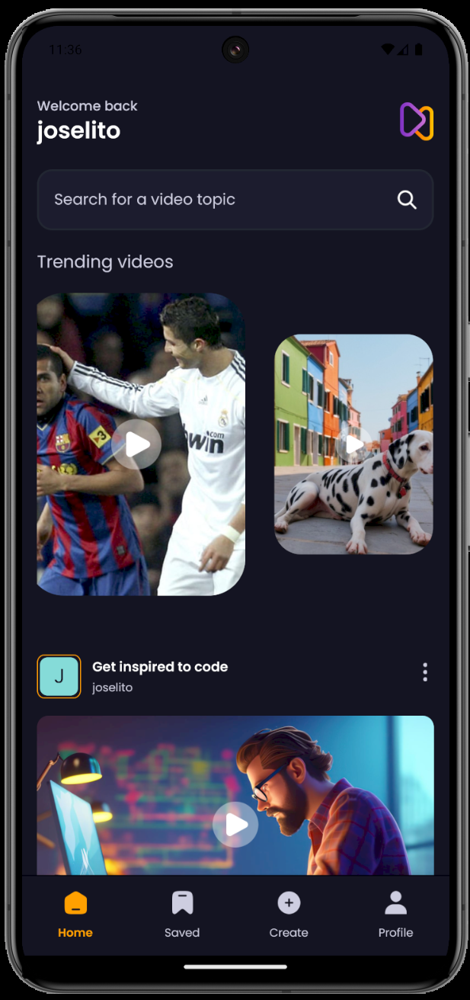
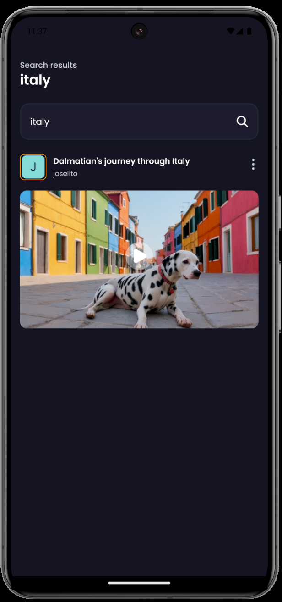
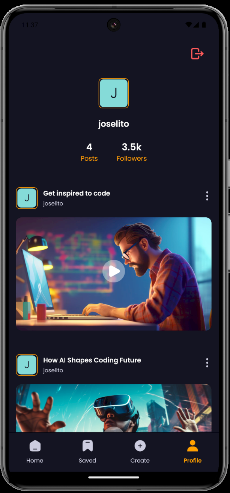
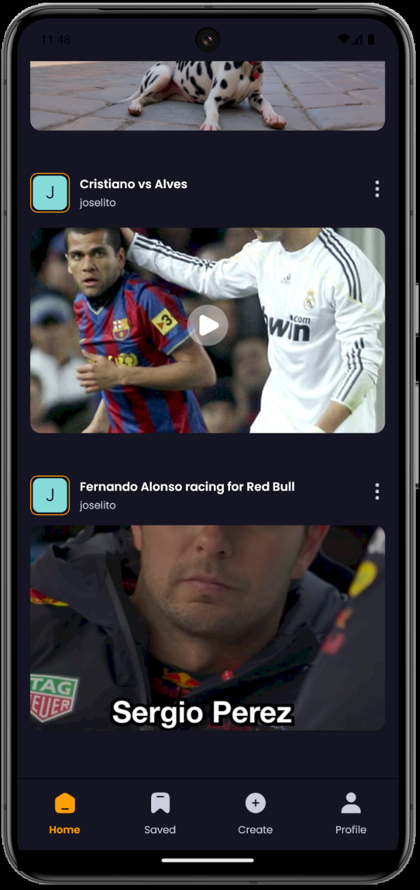

# Video Sharing App

This project is a video-sharing application. It uses **React Native**, **Appwrite** as the backend, and **Nativewind** for styling. Below is a brief description of the application's functionality and the technologies used.

## 📋 Description

The app allows users to explore recent videos, search for content by keyword, create and upload their own videos, and manage their personal profiles. It is optimized for smooth performance on mobile devices, featuring an intuitive interface and dynamic animations.

## ⚙️ Tech Stack

-   **React Native**
-   **Expo**
-   **Nativewind**
-   **Appwrite**
-   **Animatable**

## 🔋 Features

-   **Home Screen**: Browse the latest trending videos with a search bar for quick content discovery.
-   **Search**: Allows users to search for videos by keywords with instant results.
-   **User Profile**: Displays uploaded videos and related statistics.
-   **Video Uploading**: Users can upload videos with a title, description, thumbnail, and AI prompt.
-   **Creation Form**: A complete form for video creation with editable fields.
-   **Animations**: Smooth interactions powered by the Animatable library.

## 🤸 Screenshots

### 1. Home: Recent Videos and Search Bar

### 2. Search: Results for "Italy"

### 3. User Profile: Uploaded Videos

### 4. Upload Video: Creation Form

### 5. Creation Form with Filled Data

### 6. Home: Displaying the Uploaded Video

