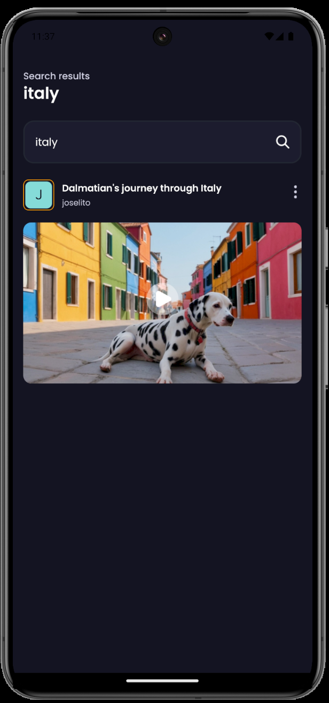
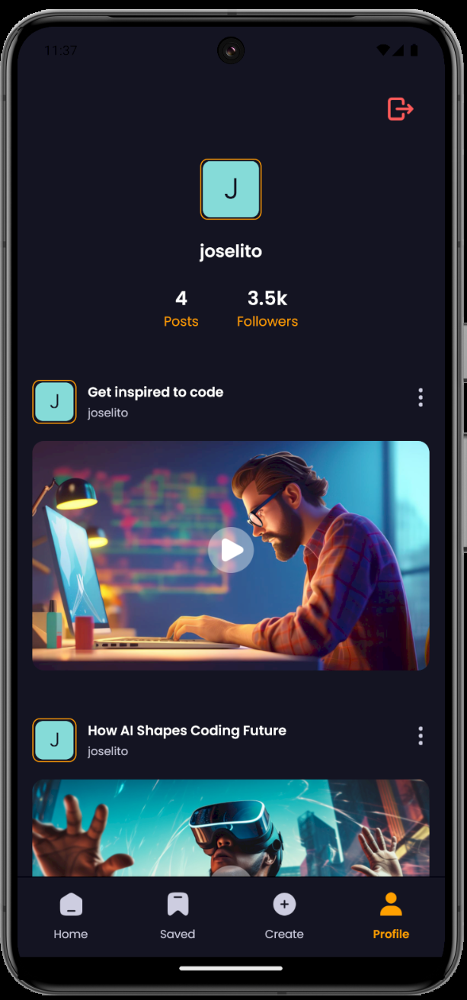
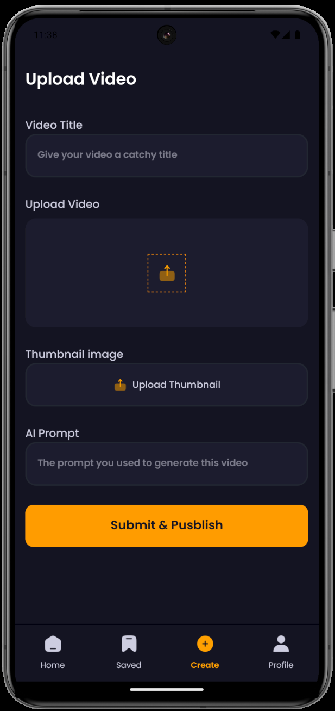
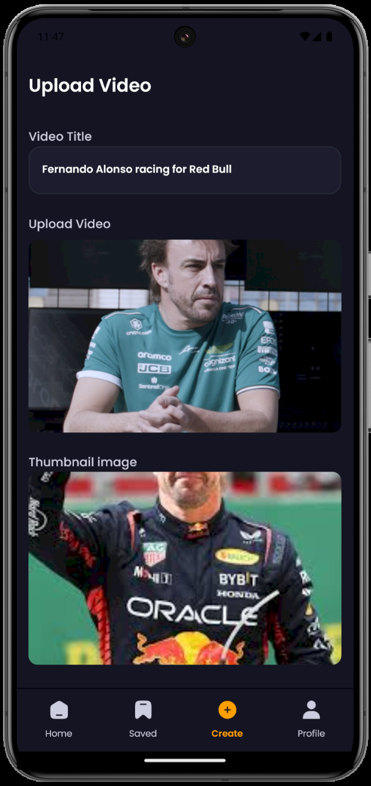
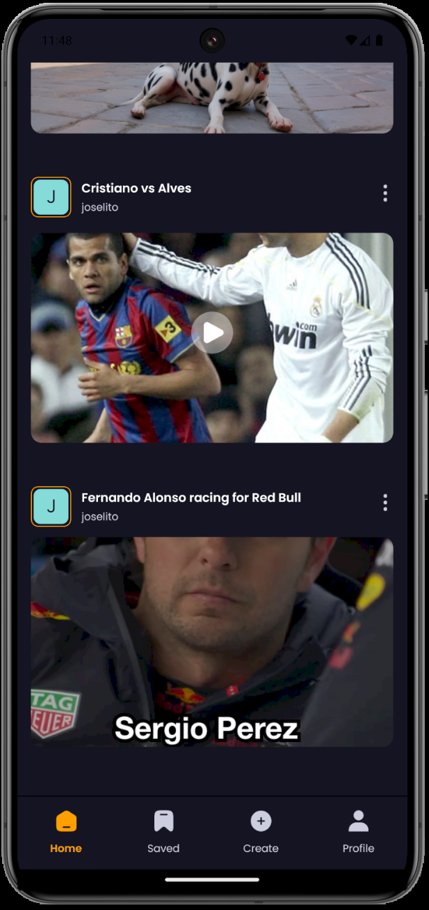

# Video Sharing App

Este proyecto es una aplicaci贸n de compartici贸n de videos construida siguiendo el tutorial de [JavaScript Mastery en YouTube](https://www.youtube.com/c/JavaScriptMastery). La idea y estructura original de la app pertenecen a su equipo. Esta aplicaci贸n utiliza **React Native**, **Appwrite** como backend y **Nativewind** para los estilos. A continuaci贸n, se muestra una breve descripci贸n de la funcionalidad de la aplicaci贸n y las tecnolog铆as utilizadas.

##  Descripci贸n

La aplicaci贸n permite a los usuarios explorar videos recientes, buscar contenido por palabra clave, crear y subir sus propios videos, y gestionar su perfil personal. La aplicaci贸n est谩 optimizada para un rendimiento fluido en dispositivos m贸viles, con una interfaz intuitiva y animaciones din谩micas.

## 锔 Tech Stack

-   **React Native**
-   **Expo**
-   **Nativewind**
-   **Appwrite**
-   **Animatable**

##  Caracter铆sticas

-   **Pantalla de Inicio**: Explora los videos m谩s recientes y los trending, con una barra de b煤squeda para encontrar contenido r谩pidamente.
-   **B煤squeda**: Permite buscar videos por palabras clave con resultados instant谩neos.
-   **Perfil de Usuario**: Muestra los videos subidos por el usuario y estad铆sticas relacionadas.
-   **Subida de Video**: Los usuarios pueden subir videos con t铆tulo, descripci贸n, miniatura y prompt de IA.
-   **Formulario de Creaci贸n**: Incluye un formulario completo para la creaci贸n de videos con campos editables.
-   **Animaciones**: Interacciones suaves gracias a la biblioteca Animatable.

## じ Capturas de Pantalla

### 1. Home: Videos Recientes y Barra de B煤squeda

### 2. B煤squeda: Resultado al Buscar "Italy"

### 3. Perfil del Usuario: Videos Subidos

### 4. Subir Video: Formulario de Creaci贸n

### 5. Formulario de Creaci贸n con Datos Llenos

### 6. Home: Mostrando el Video Subido

